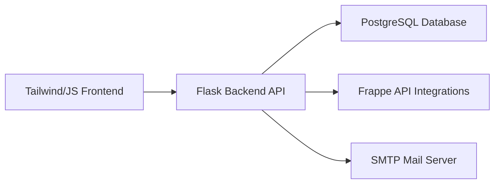
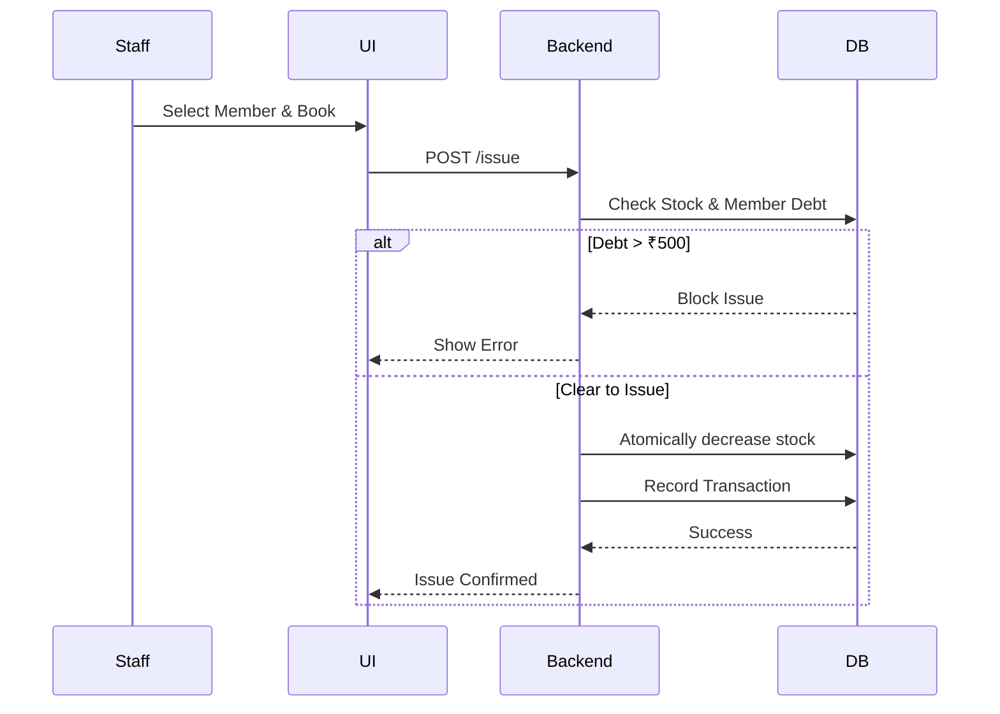

<div align="center">
  
# 📚 LibraryOS — Library Management System
  
### Production-Grade Library Management Web Application

A robust, modern platform with role-based staff accounts, a complete book/member/loan workflow, automatic fines, reservations, audit logging, a comprehensive REST API, and a beautiful dashboard.

**Live Demo:** https://library-management-flask-e0zz.onrender.com

---

[](https://www.python.org)
[](https://flask.palletsprojects.com/)
[](https://www.postgresql.org/)
[](https://tailwindcss.com/)
[](https://opensource.org/licenses/MIT)

</div>

---

> **Complete workflow:** Register Org → Add Books (or Import API) → Register Members → Issue/Return Books → Monitor Analytics
>
> ### Demo Credentials
> *(If you host a live demo, provide test credentials here)*

| Field | Value |
|-------|-------|
| Email | admin@libraryos.local |
| Password | admin123 |

---

## 🚀 Overview

LibraryOS is a full-stack, production-ready application built to streamline operations for modern libraries. 

Instead of just tracking inventory, the platform handles complex workflows including race-safe concurrent transactions, automatic grace periods, fine calculations, and hold queues. It demonstrates modern software engineering practices such as role-based access control (RBAC), robust REST APIs, security best practices (CSRF, Rate Limiting), and beautiful responsive UI.

> 💡 **Setup on Windows?** Check out the [`Setup_and_Configuration_Guide.pdf`](Setup_and_Configuration_Guide.pdf) in this repository for a complete Windows walkthrough (PowerShell venv activation, Task Scheduler, Windows-compatible servers like Waitress).

---

## ✨ Highlights

- Single-Organization architecture with Staff/Admin RBAC
- FastAPI-like REST API with token authentication
- Beautiful, responsive UI with Tailwind CSS & GSAP animations
- PostgreSQL for robust, relational data storage
- Race-safe atomic transactions for stock management
- Automated fine calculation & borrowing restrictions
- Hold queue / Reservation system
- Bulk book import via Frappe Library API
- Comprehensive Admin Audit Logs
- Production-ready security (CSRF, Rate Limiting, Hashing)

---

## 🏗️ Architecture



---

## 🔄 Book Issue Workflow



---

## ⚙️ Tech Stack

### Frontend
- **HTML5 / Jinja2** - Server-side rendering
- **Tailwind CSS** - Modern utility-first styling
- **GSAP & Lenis** - Smooth animations and scrolling
- **Chart.js** - Interactive dashboard analytics

### Backend
- **Python / Flask** - Core routing and logic
- **Flask-SQLAlchemy** - ORM for database interactions
- **Flask-Migrate** - Schema migrations (Alembic)
- **Flask-Login** - Session management
- **Flask-Limiter** - API Rate Limiting (Redis-compatible)
- **Requests** - External API communication

### DevOps & Security
- **PostgreSQL** - Production Database
- **Gunicorn** - WSGI HTTP Server
- **Werkzeug Security** - Password hashing
- **CSRFProtect** - Cross-Site Request Forgery protection

---

## 📂 Project Structure

<details>
<summary><b>Click to expand the directory tree</b></summary>

```text
library-management-flask/
│
├── app.py              # App factory / blueprint registration
├── config.py           # Env-driven configuration
├── db.py               # SQLAlchemy + Migrate setup
├── extensions.py       # Shared extension instances
├── models.py           # Database Models
├── auth.py             # Auth & password workflows
├── books.py            # Book CRUD & Frappe import
├── members.py          # Member CRUD
├── transactions.py     # Issue/return logic
├── reservations.py     # Hold queue
├── audit.py            # Admin audit log
├── api.py              # REST API
├── mailer.py           # SMTP integration
├── reminders.py        # CLI command for reminders
├── migrations/         # Alembic migrations
├── static/             # CSS/JS
└── templates/          # Jinja2 templates
```
</details>

---

## 🚀 Local Setup

Clone the repository and jump in:

```bash
git clone https://github.com/iHiteshShibag/library-management-flask.git
cd library-management-flask
```

Set up your virtual environment and dependencies:

```bash
python3 -m venv venv
source venv/bin/activate   # On Windows: venv\Scripts\activate
pip install -r requirements.txt
```

Configure the environment variables:

```bash
cp .env.example .env
# Edit .env to add your SECRET_KEY and DATABASE_URL
```

Initialize the database and run the app:

```bash
flask db upgrade
python app.py
```

Access the app at `http://127.0.0.1:5000`.

---

## ☁️ Production Deployment

Before making this reachable by real users, complete this deployment checklist:

| Service | Recommendation |
|---------|----------|
| **Server** | Use Gunicorn (`gunicorn app:app --workers 4`) behind Nginx or Caddy. |
| **Database** | Managed PostgreSQL (e.g., Supabase, Neon, RDS). |
| **Security** | Serve over HTTPS, set `SESSION_COOKIE_SECURE=true`. |
| **Caching/Limits** | Point `RATELIMIT_STORAGE_URI` at Redis if using multiple workers. |
| **Email** | Configure SMTP settings in `.env` for password resets. |

---

## 📊 API Documentation

LibraryOS provides a secure, token-based REST API.

**Authentication:** `Authorization: Bearer <your_api_key>` (Generate from profile settings).

| Endpoint | Methods | Description |
|:---|:---:|:---|
| `/api/v1/books` | `GET`, `POST` | List all books or add a new book |
| `/api/v1/books/<id>` | `GET`, `PATCH`, `DELETE` | View, update, or remove a specific book |
| `/api/v1/members` | `GET`, `POST` | List all library members or register a new one |
| `/api/v1/transactions` | `GET` | View issue and return history |
| `/api/v1/issue` | `POST` | Issue a book to a member |
| `/api/v1/return` | `POST` | Return a book (calculates fines automatically) |
| `/api/v1/me` | `GET` | Get current authenticated user info |

---

## 🧪 Testing

The platform includes a comprehensive `pytest` smoke suite covering core workflows (auth, books, members, transactions, API). 

To run tests against a real Postgres database (recommended over SQLite to avoid dialect bugs):

```bash
pip install -r requirements-dev.txt
# Create a test DB: CREATE DATABASE library_test OWNER library;
pytest
```

---

## 📸 Screenshots

*(Add screenshots of your application here by replacing the placeholder links)*

### Animated Dashboard


---

### Book Management & Bulk Import


---

### Transaction History & Fines


---

## 🗺️ Roadmap

- [x] RESTful API implementation
- [x] JWT / Token-based API Auth
- [x] Book hold queues / Reservations
- [x] Automated fine calculation
- [x] Frappe Library API integration
- [ ] Implement Redis for caching frequent queries
- [ ] Add Docker / Docker Compose support
- [ ] Export dashboard charts as PDFs
- [ ] Barcode / QR Code scanning for physical book issues

---

## 🤝 Contributing

Contributions, feature requests, and bug reports are warmly welcomed.

**Fork → Branch → Commit → Pull Request**

---

## 📜 License

MIT License — free to use, modify, and distribute for educational and personal purposes.

---

## 👨‍💻 Author

**Hitesh Shibag** — [GitHub](https://github.com/iHiteshShibag)

<div align="center">
  <i>If you found this project helpful, consider giving it a ⭐ on GitHub!</i>
</div>
